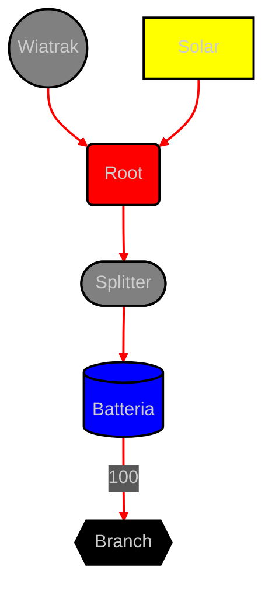

```mermaid
  graph TD;
    %%{init: {'theme':'dark'}}%%
    %% Class Definitions
    classDef root fill:#ff0000,stroke:#000,stroke-width:2,color:#fff; %% Red background, white text
    classDef branch fill:#000000,stroke:#000,stroke-width:2,color:#fff; %% Black background, white text
    classDef wind fill:gray,stroke:#000,stroke-width:2,color:#fff; %% Grey background, white text circle
    classDef solar fill:yellow,stroke:#000,stroke-width:2,color:#000; %% Yellow background, black text
    classDef batt fill:blue,stroke:#000,stroke-width:2,color:#000; %% Light blue background, black text
    classDef splitter fill:gray,stroke:#000,stroke-width:2,color:#000; %% Light grey background, black text
  
    Wind1((Wiatrak))
    Solar1[Solar]
    Root1(Root)
    Splitter1([Splitter])
    Batt1[(Batteria)]
    Branch1{{Branch}}

    %% Graph Nodes
    Wind1 -->| | Root1;
    Solar1 -->| | Root1;
    Root1 -->| | Splitter1;
    Splitter1 -->| | Batt1;
    Batt1 -->|100| Branch1;

    %% Link Styles
    linkStyle 0,1,2,3,4 stroke:red,stroke-width:2;

    %% Class Assignments
    class Root1 root;
    class Branch1 branch;
    class Wind1 wind;
    class Solar1 solar;
    class Batt1 batt;
    class Splitter1 splitter;
```
