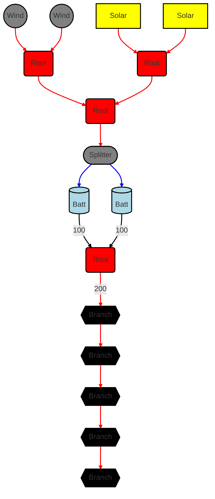

```mermaid
  graph TD;
    %% Class Definitions
    classDef root fill:#ff0000,stroke:#000,stroke-width:2,color:#fff; %% Red background, white text
    classDef branch fill:#000000,stroke:#000,stroke-width:2,color:#fff; %% Black background, white text
    classDef wind fill:gray,stroke:#000,stroke-width:2,color:#fff; %% Grey background, white text circle
    classDef solar fill:yellow,stroke:#000,stroke-width:2,color:#000; %% Yellow background, black text
    classDef batt fill:#add8e6,stroke:#000,stroke-width:2,color:#000; %% Light blue background, black text
    classDef splitter fill:gray,stroke:#000,stroke-width:2,color:#000; %% Light grey background, black text
  
    Wind1((Wind))
    Wind2((Wind))
    Solar1[Solar]
    Solar2[Solar]
    Root1(Root)
    Root2(Root)
    Root3(Root)
    Root4(Root)
    Splitter1([Splitter])
    Batt1[(Batt)]
    Batt2[(Batt)]
    Branch1{{Branch}}
    Branch2{{Branch}}
    Branch3{{Branch}}
    Branch4{{Branch}}
    Branch5{{Branch}}

    %% Graph Nodes
    Wind1 -->| | Root1;
    Wind2 -->| | Root1;
    Solar1 -->| | Root2;
    Solar2 -->| | Root2;
    Root1 -->| | Root3;
    Root2 -->| | Root3;
    Root3 -->| | Splitter1;
    Splitter1 -->| | Batt1;
    Splitter1 -->| | Batt2;
    Batt1 -->|100| Root4;
    Batt2 -->|100| Root4;
    Root4 -->|200| Branch1;
    Branch1 --> Branch2;
    Branch2 --> Branch3;
    Branch3 --> Branch4;
    Branch4 --> Branch5;

    %% Link Styles
    linkStyle 0,1,2,3,4,5,6,11,12,13,14,15 stroke:red,stroke-width:2;
    linkStyle 7,8 stroke:blue,stroke-width:2;
    linkStyle 9,10 stroke:black,stroke-width:2;

    %% Class Assignments
    class Root1,Root2,Root3,Root4 root;
    class Branch1,Branch2,Branch3,Branch4,Branch5 branch;
    class Wind1,Wind2 wind;
    class Solar1,Solar2 solar;
    class Batt1,Batt2 batt;
    class Splitter1 splitter;
```
