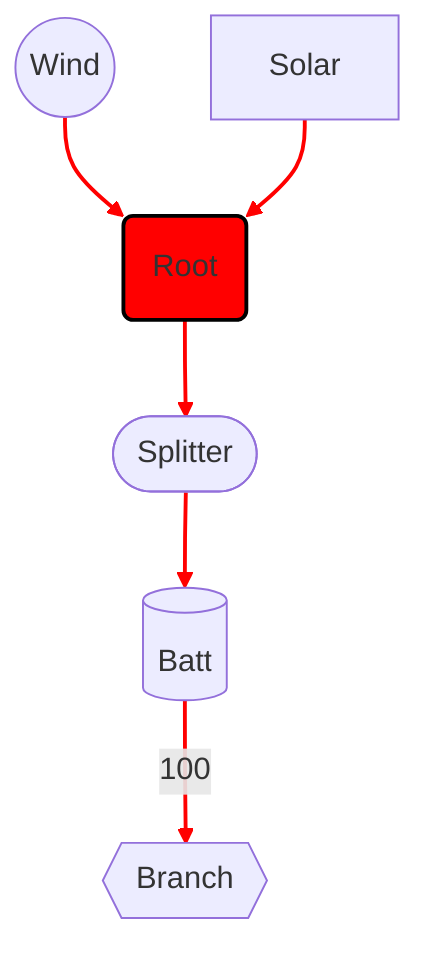

```mermaid
  graph TD;
    %% Class Definitions
    classDef root fill:#ff0000,stroke:#000,stroke-width:2,color:#fff; %% Red background, white text
  
    Wind1((Wind))
    Solar1[Solar]
    Root1(Root)
    Splitter1([Splitter])
    Batt1[(Batt)]
    Branch1{{Branch}}

    %% Graph Nodes
    Wind1 -->| | Root1;
    Solar1 -->| | Root1;
    Root1 -->| | Splitter1;
    Splitter1 -->| | Batt1;
    Batt1 -->|100| Branch1;

    %% Link Styles
    linkStyle 0,1,2,3,4 stroke:red,stroke-width:2;

    %% Class Assignments
    class Root1 root;
```
