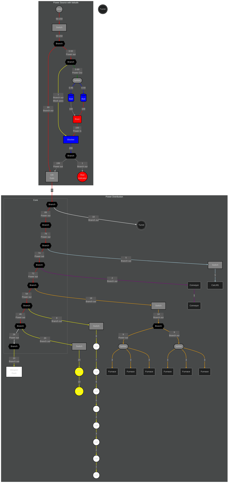

```mermaid
  graph TD;
    %%{init: {'theme':'dark'}}%%
    %% Class Definitions
    classDef root fill:#ff0000,stroke:#000,stroke-width:2,color:#fff; %% Red background, white text
    classDef branch fill:#000000,stroke:#000,stroke-width:2,color:#fff; %% Black background, white text
    classDef wind fill:gray,stroke:#000,stroke-width:2,color:#fff; %% Grey background, white text circle
    classDef solar fill:yellow,stroke:#000,stroke-width:2,color:#000; %% Yellow background, black text
    classDef batt fill:blue,stroke:#000,stroke-width:2,color:#000; %% Light blue background, black text
    classDef splitter fill:gray,stroke:#000,stroke-width:2,color:#000; %% Light grey background, black text
    classDef switch fill:gray,stroke:#000,stroke-width:2,color:#000; %% Light grey background, black text
    classDef gates fill:gray,stroke:#000,stroke-width:2,color:#000; %% Light grey background, black text
    classDef blocker fill:blue,stroke:#000,stroke-width:2,color:#000; %% Light blue background, black text
    classDef red_light fill:#ff0000,stroke:#000,stroke-width:2,color:#fff; %% Red background, white text
    classDef white_light fill:#fff,stroke:#000,stroke-width:2,color:#000; %% White background, black text
    classDef yellow_light fill:yellow,stroke:#000,stroke-width:2,color:#000; %% Yellow background, black text
    Wind1((Wind));
    Root1(Root);
    %%Solar1[Solar];
    Splitter1([Splitter]);
    Splitter2([Splitter]);
    Splitter3([Splitter]);
    Batt1[(Batt)];
    Batt2[(Batt)];
    Branch1{{Branch}};
    Branch2{{Branch}};
    Branch3{{Branch}};
    Branch4{{Branch}};
    Branch5{{Branch}};
    Branch6{{Branch}};
    Branch7{{Branch}};
    Branch8{{Branch}};
    Branch9{{Branch}};
    Branch10{{Branch}};
    Branch11{{Branch}};
    Branch12{{Branch}};
    Switch1[Switch];
    Switch2[Switch];
    Switch3[Switch];
    Switch4[Switch];
    Switch5[Switch];
    Blocker1[Blocker];
    OrGate1["OR<br>Gate"];
    LightRed1(("Red<br>Indicator"));
    Furnace1(Furnace);
    Furnace2(Furnace);
    Furnace3(Furnace);
    Furnace4(Furnace);
    Furnace5(Furnace);
    Furnace6(Furnace);
    Light1((Light));
    Light2((Light));
    Light3((Light));
    Light4((Light));
    Light5((Light));
    Light6((Light));
    Light7((Light));
    Light8((Light));
    LightSearch1(("Search<br>Light"));
    LightSearch2(("Search<br>Light"));
    WeaponRack1["Weapon<br>Rack"];
    Turret1(((Turret)));
    Turret2(((Turret)));
    Conveyor1(Conveyor);
    Conveyor2(Conveyor);

    %% Power Source with failsafe
    subgraph "Power Source with failsafe"
      Wind1 -->|50-150| Switch1;
      Switch1 -->|50-150| Branch1;
      Branch1 -->|"99<br>Branch out"| OrGate1;
      Branch1 -->|"0-50<br>Power out"| Branch2;
      Branch2 -->|"1<br>Branch out<br>Block pass"| Blocker1; 
      Branch2 -->|"0-89<br>Power Out"| Splitter1;
      Splitter1 -->|0-45| Batt1;
      Splitter1 -->|0-44| Batt2;
      Blocker1 -->|"200"| Branch3;
      Branch3 -->|"199<br>Power out"| OrGate1;
      Branch3 -->|"1<br>Branch out"| LightRed1;
      Batt1 -->|"100"| Root1;
      Batt2 -->|"100"| Root1;
      Root1 -->|"100<br>Power in"| Blocker1;
    end

    OrGate1 -->|99| Branch4;

    %% Power Distribution
    subgraph "Power Distribution"
      subgraph "Core"
        Branch4
        Branch5
        Branch6
        Branch7
        Branch8
        Branch9
        Branch10
        Branch11
      end
      Branch4 -->|"89<br>Power out"| Branch5;
      Branch5 -->|"79<br>Power out"| Branch6;
      Branch6 -->|"74<br>Power out"| Branch7;
      Branch7 -->|"72<br>Power out"| Branch8;
      Branch8 -->|"54<br>Power out"| Branch9;
      Branch9 -->|"46<br>Power out"| Branch10;
      Branch10 -->|"26<br>Power out"| Branch11;

      Branch4 -->|"10<br>Branch out"| Turret1;

      Branch6 -->|"5<br>Branch out"| Switch2;
      Switch2 -->|5| CarLift1;

      Branch7 -->|"2<br>Branch out"| Conveyor1
      Conveyor1 -->|1| Conveyor2;

      Branch8 -->|"18<br>Branch out"| Switch3;
      Switch3 -->|"18<br>Branch out"| Branch12;
      Branch12 -->|"9<br>Power out"| Splitter2;
      Branch12 -->|"9<br>Branch out"| Splitter3;
      Splitter2 -->|3| Furnace1;
      Splitter2 -->|3| Furnace2;
      Splitter2 -->|3| Furnace3;
      Splitter3 -->|3| Furnace4;
      Splitter3 -->|3| Furnace5;
      Splitter3 -->|3| Furnace6;

      Branch9 -->|"8<br>Branch out"| Switch4;
      Switch4 -->|8| Light1;
      Light1 -->|7| Light2;
      Light2 -->|6| Light3;
      Light3 -->|5| Light4;
      Light4 -->|4| Light5;
      Light5 -->|3| Light6;
      Light6 -->|2| Light7;
      Light7 -->|1| Light8;

      Branch10 -->|"20<br>Branch out"| Switch5;
      Switch5 -->|20| LightSearch1;
      LightSearch1 -->|10| LightSearch2;

      Branch11 -->|"20<br>Branch out"| WeaponRack1;
    end

    %% Link Styles
    linkStyle 0,1,2,3,12,13,14,15,16,17,18,19,20 stroke:red,stroke-width:2;
    linkStyle 4,37,38,39,40,41,42,43,44,45,46,47,48,49 stroke:yellow,stroke-width:2;
    linkStyle 27,26,28,29,30,31,32,33,34,35,36 stroke:orange,stroke-width:2;
    linkStyle 25,26 stroke:purple,stroke-width:2;
    linkStyle 23,24 stroke:lightblue,stroke-width:2;
    linkStyle 21,22 stroke:white,stroke-width:2;
    linkStyle 5 stroke:green,stroke-width:2;
    linkStyle 6,7,8 stroke:blue,stroke-width:2;

    %% Class Assignments
    class Root1 root;
    class Branch1 branch;
    class Branch2 branch;
    class Branch3 branch;
    class Branch4 branch;
    class Branch5 branch;
    class Branch6 branch;
    class Branch7 branch;
    class Branch8 branch;
    class Branch9 branch;
    class Branch10 branch;
    class Branch11 branch;
    class Branch12 branch;
    class Wind1 wind;
    class Solar1 solar;
    class Batt1 batt;
    class Batt2 batt;
    class Splitter1 splitter;
    class Splitter2 splitter;
    class Splitter3 splitter;
    class OrGate1 gates;
    class Switch1 switch;
    class Switch2 switch;
    class Switch3 switch;
    class Switch4 switch;
    class Switch5 switch;
    class Blocker1 blocker;
    class LightRed1 red_light;
    class Light1 white_light;
    class Light2 white_light;
    class Light3 white_light;
    class Light4 white_light;
    class Light5 white_light;
    class Light6 white_light;
    class Light7 white_light;
    class Light8 white_light;
    class LightSearch1 yellow_light;
    class LightSearch2 yellow_light;
    class WeaponRack1 white_light;
```
