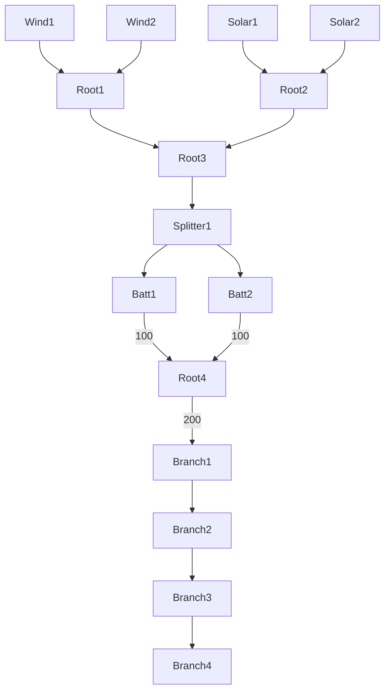

```mermaid
  graph TD;
      Wind1-->Root1;
      Wind2-->Root1;
      Solar1-->Root2;
      Solar2-->Root2;
      Root1-->Root3;
      Root2-->Root3
      Root3--> Splitter1;
      Splitter1-->Batt1;
      Splitter1-->Batt2;
      Batt1-->|100|Root4;
      Batt2-->|100|Root4;
      Root4-->|200|Branch1;
      Branch1-->Branch2;
      Branch2-->Branch3
      Branch3-->Branch4
```
