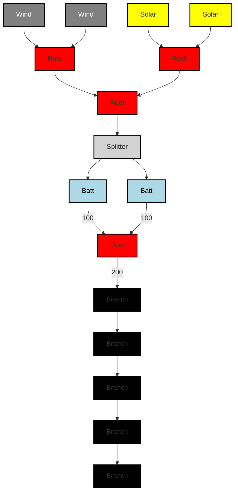

```mermaid
  graph TD;
    %% Class Definitions
    classDef root fill:#ff0000,stroke:#000,stroke-width:2,color:#fff; %% Red background, white text
    classDef branch fill:#000000,stroke:#000,stroke-width:2,color:#fff; %% Black background, white text
    classDef wind fill:#808080,stroke:#000,stroke-width:2,color:#fff,shape:circle; %% Grey background, white text, circle
    classDef solar fill:#ffff00,stroke:#000,stroke-width:2,color:#000; %% Yellow background, black text
    classDef batt fill:#add8e6,stroke:#000,stroke-width:2,color:#000,shape:database; %% Light blue background, black text
    classDef splitter fill:#d3d3d3,stroke:#000,stroke-width:2,color:#000; %% Light grey background, black text

    %% Graph Nodes
    Wind1[Wind] --> Root1[Root];
    Wind2[Wind] --> Root1[Root];
    Solar1[Solar] --> Root2[Root];
    Solar2[Solar] --> Root2[Root];
    Root1[Root] --> Root3[Root];
    Root2[Root] --> Root3[Root];
    Root3[Root] --> Splitter1[Splitter];
    Splitter1[Splitter] --> Batt1[Batt];
    Splitter1[Splitter] --> Batt2[Batt];
    Batt1[Batt] -->|100| Root4[Root];
    Batt2[Batt] -->|100| Root4[Root];
    Root4[Root] -->|200| Branch1[Branch];
    Branch1[Branch] --> Branch2[Branch];
    Branch2[Branch] --> Branch3[Branch];
    Branch3[Branch] --> Branch4[Branch];
    Branch4[Branch] --> Branch5[Branch];

    %% Class Assignments
    class Root1,Root2,Root3,Root4 root;
    class Branch1,Branch2,Branch3,Branch4,Branch5 branch;
    class Wind1,Wind2 wind;
    class Solar1,Solar2 solar;
    class Batt1,Batt2 batt;
    class Splitter1 splitter;
```
